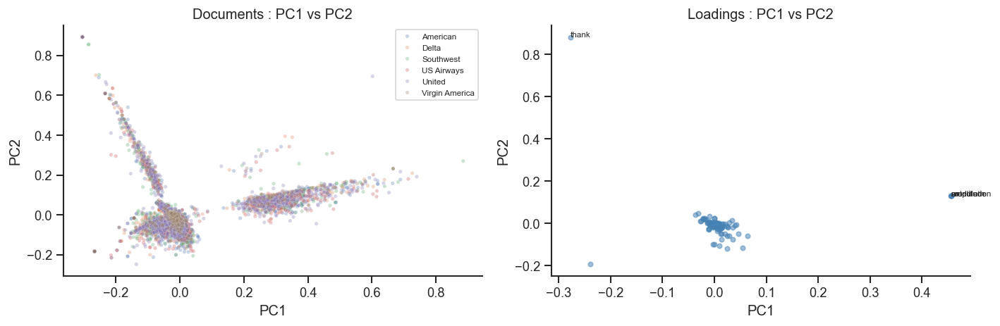
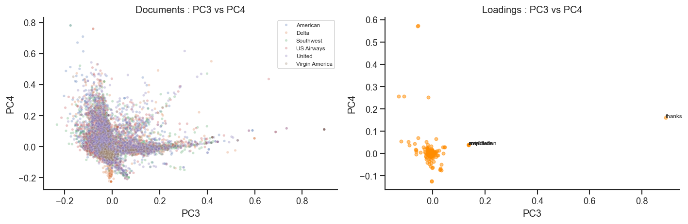
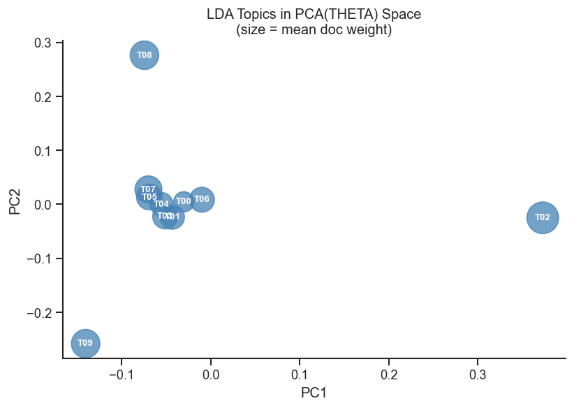
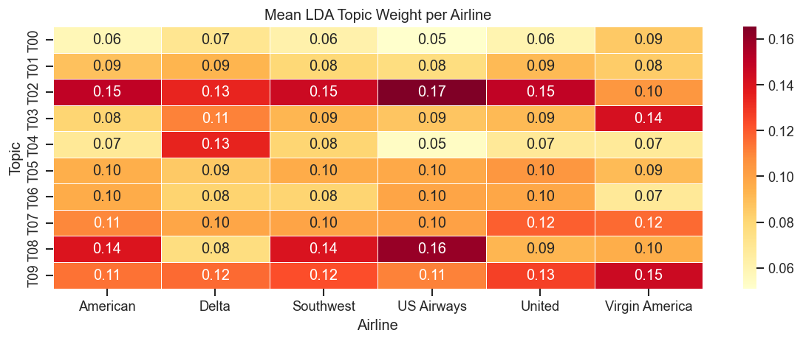
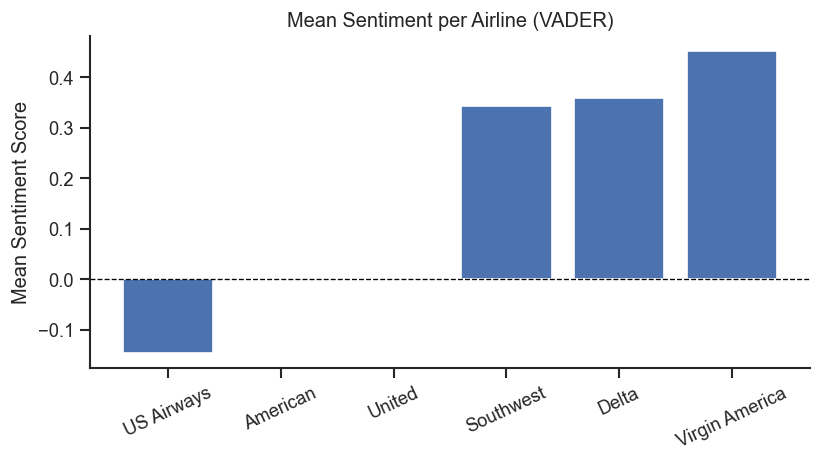
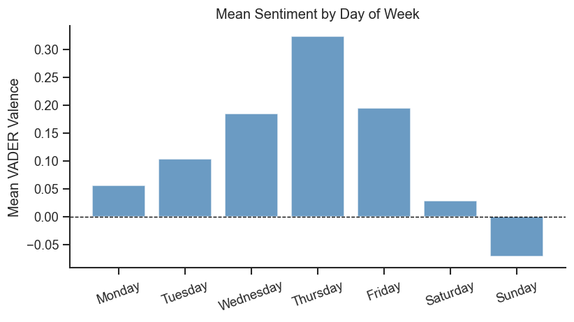
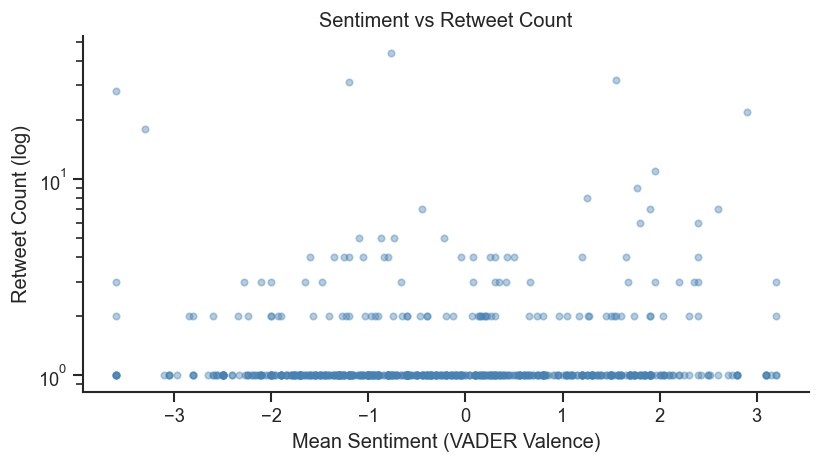
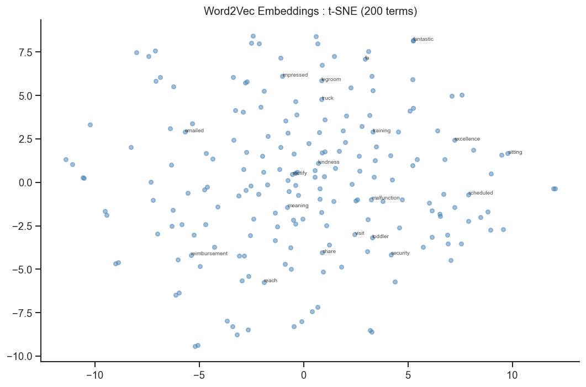

# Airline Tweet Sentiment and Topic Analysis

This project applies a full NLP pipeline to 14,640 tweets directed at six major US airlines ; American, Delta, Southwest, United, US Airways, and Virgin America ; collected over an eight-day period in February 2015. The goal was to move from raw social media text to interpretable models of language, sentiment, and topic structure, without relying on the pre-existing crowd-sourced labels.

The project was completed as part of DS 5001: Text as Data at the University of Virginia.

---

## Data

The source data is the [Twitter US Airline Sentiment dataset](https://www.kaggle.com/datasets/crowdflower/twitter-airline-sentiment) from Kaggle, originally compiled by CrowdFlower. Each tweet is paired with metadata, including the airline handle, timestamp, retweet count, and user timezone. Sentiment labels were generated independently using VADER rather than the crowd-sourced annotations.

---

## Pipeline

The project follows a structured text analytics workflow across two notebooks.

**text_preprocessing.ipynb** handles data cleaning before we move onto text preparation for modeling, ensuring column extraction, data type consistency, handling missing values etc.
**text_preparation.ipynb** handles ingestion, parsing, and vectorization. The raw CSV is parsed into three core tables: a library table (LIB) with one row per airline summarizing metadata, a token-level corpus table (CORPUS) indexed by airline, day, tweet, sentence, and token position, and a vocabulary table (VOCAB) containing term frequencies, TF-IDF weights, POS tags, and stemmed forms. The corpus contains 284,463 tokens across 9,688 unique vocabulary terms. TF-IDF is computed at the tweet level and L2-normalized for downstream modeling.

**text_modelling.ipynb** applies four unsupervised models to the processed corpus: PCA, LDA topic modeling, VADER sentiment analysis, and Word2Vec embeddings.

---

## Models and Results

### Principal Component Analysis

PCA was applied to the top 200 terms ranked by DFIDF, reduced to 20 components explaining 30.28% of cumulative variance. The document scatter plots below show tweets colored by airline across the first four principal components.

*Documents and word loadings in the space of PC1 and PC2. Airlines overlap heavily, suggesting that delay and complaint vocabulary is shared across carriers rather than specific to any one airline.*

*Documents and word loadings in the space of PC3 and PC4. The pattern of overlap continues, with only a small number of words driving variance in these components.*

---

### LDA Topic Modeling

LDA was fit on nouns and verbs only, filtering to a vocabulary of 1,694 terms with a minimum corpus frequency of five. Ten topics were extracted. The five most interpretable topics by mean document weight are shown below.

| Topic | Label | Top Words |
|-------|-------|-----------|
| T02 | Flight Delays and Cancellations | flight, cancel, delay, miss, time |
| T03 | Booking Problems | book, hell, flight, problem, time |
| T04 | Thank-You and Airport Communications | thank, airport, send, message, time |
| T08 | Customer Support | call, hold, phone, wait, hour |
| T09 | Flight Connections | connect, gate, seat, fly, need |

Applying PCA to the topic distribution matrix (THETA) shows how distinct each topic is relative to the others.

*Each bubble represents a topic, sized by its mean weight across all documents. T02 (Flight Delays) sits far to the right and is the largest bubble, confirming it as the dominant theme in the corpus. Most other topics cluster near the center, indicating substantial overlap in vocabulary.*

The heatmap below shows how topic weights vary across airlines.

*T02 is the strongest topic for every airline, most sharply for US Airways and United. Virgin America shows a comparatively higher weight on booking-related topics (T03), while American and Southwest show elevated weights on customer support (T08).*

---

### Sentiment Analysis

Sentiment was scored at the tweet level using VADER and aggregated by airline and by day of week.

*US Airways and American receive the most negative mean sentiment scores. Southwest, Delta, and Virgin America are positive on average, with Virgin America the highest of the six. The gap between legacy carriers and newer or regional airlines is visible here.*

*Sentiment rises steadily from Monday through Thursday, then falls sharply over the weekend. Sunday is the only day with a negative mean score. One interpretation is that business travelers, who tend to tweet on weekdays, have more routine and predictable experiences, while leisure travelers flying on weekends encounter more disruptions.*

---

### Sentiment and Virality

*Retweet count is on a log scale. Most tweets receive no retweets regardless of sentiment. The tweets that spread most widely appear at both ends of the sentiment spectrum, suggesting that emotional intensity matters more than direction. Strongly negative tweets tend to spread slightly more than strongly positive ones.*

---

### Word2Vec Embeddings

Word2Vec was trained at the sentence level using Gensim with 100 embedding dimensions, a window size of five, and a minimum term frequency of five over 15 training epochs. The 200 most frequent terms are plotted below using t-SNE dimensionality reduction.

*Words like "fantastic", "impressed", and "legroom" cluster together in the upper portion of the plot, reflecting positive service language. Words like "reimbursement", "reach", and "malfunction" group separately in a lower cluster associated with complaints and escalations. The model learned these associations from context alone, without any sentiment labels.*

---

## Key Findings

Flight delays and cancellations are the single dominant topic across all six airlines, appearing consistently regardless of carrier. This suggests the issue is perceived as an industry-wide problem rather than one specific to any airline.

Sentiment differs meaningfully across airlines. US Airways and American receive net negative scores while Virgin America, Delta, and Southwest are net positive. These differences persist even after controlling for tweet volume.

Day-of-week patterns in sentiment likely reflect differences in traveler type. Weekday tweets skew positive and weekend tweets skew negative, with Sunday being the only day below the neutral line.

Virality is driven by emotional intensity rather than sentiment direction. Tweets at both extremes of the sentiment scale tend to spread more than neutral ones, with negative tweets spreading slightly more overall.

The Word2Vec model successfully separates service praise from complaint language in embedding space, demonstrating that meaningful semantic structure can be recovered from short, informal social media text.

---

## Tech Stack

Python, pandas, NumPy, NLTK, VADER, scikit-learn (PCA, LDA), Gensim (Word2Vec), matplotlib, seaborn, Parquet

---
